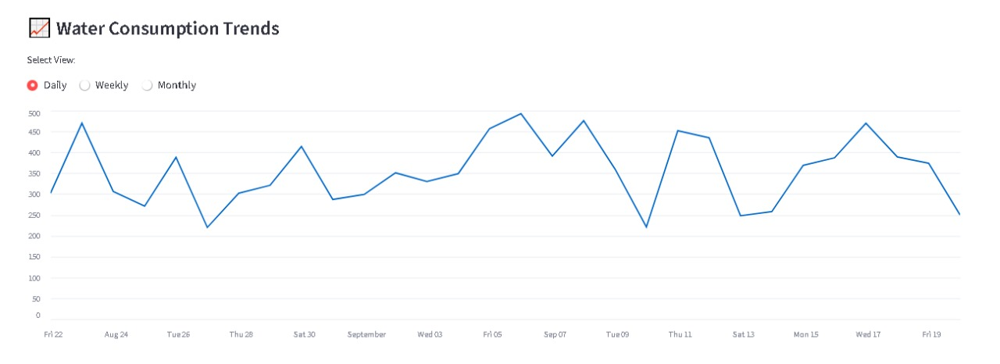
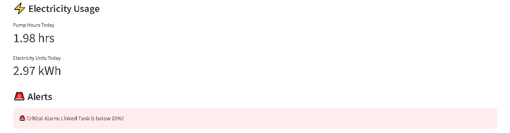

# 💧 Water Monitoring Dashboard (Prototype)

This project is a prototype dashboard for monitoring household water usage and electricity consumption, designed as part of an IoT-inspired system.

---

## 🚀 Features
- Real-time **tank visualizations** with proportional height and smooth water-fill animation  
- **Daily, weekly, and monthly** consumption plots  
- **Electricity usage** (pump hours and units)  
- **Alerts**:  
  - Bore flow rate issues  
  - Critical low water level  
  - Leak detection (abnormal usage)  

---
## 📊 Demo Screenshots
*(Simulated data – real dataset not included for privacy reasons)*

  

  

  


---

## ⚙️ How It Works
- Current version uses **simulated data** (`numpy` and `pandas`)  
- Real sensor data will be integrated via request api.
- Can't add due to privacy concerns.  

---

## 🔒 Data Privacy
Real household data has **not been included** in this repository due to privacy reasons.  
This repo contains **only the prototype UI + dummy data** for demonstration purposes.  

---

## 🛠️ Tech Stack
- [Streamlit](https://streamlit.io/) → for interactive dashboard  
- [Plotly](https://plotly.com/python/) → for plotting  
- Python (`pandas`, `numpy`) → for data simulation and handling  

---

## ▶️ Run Locally
```bash
# Clone the repo
git https://github.com/Hunaina-Ehsan/water-monitoring-dashboard-streamlit-based-
cd water-monitoring-dashboard-streamlit-based-

# Install dependencies
pip install -r requirements.txt

# Run Streamlit app
streamlit run app.py
